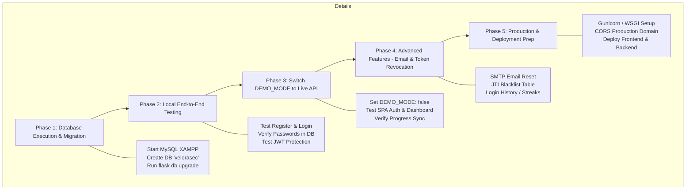

# LAPORAN AUDIT TEKNIS MENYELURUH (TECHNICAL AUDIT & PROJECT REVIEW)
**Project Name:** VeloraSec — Cybersecurity Learning Hub  
**Role:** Technical Lead / Senior Full Stack Software Architect / QA Engineer  
**Tanggal Audit:** 23 Juli 2026  
**Status Audit:** Completed (No Code Modification Executed)

---

# Ringkasan Kondisi Project

Project **VeloraSec** telah mengalami kemajuan pesat dan berada pada transisi dari **Standalone Single Page Application (SPA) berbasis Frontend Demo** menuju **Full Stack Web Application terintegrasi**. 

Saat ini, **seluruh arsitektur frontend service layer (API facade)** dan **fondasi backend (Flask API + SQLAlchemy Models + JWT Auth + Modular Blueprints)** telah siap 100% di tingkat kode. Seluruh modul backend telah dites *syntax check* dan seluruh *dependency* Python terpasang dalam *virtual environment* (`venv`). 

Tahap berikutnya yang tersisa adalah **eksekusi fisik pembuataan database MySQL (di XAMPP)** oleh user, running **database migration (`flask db upgrade`)**, dan pengubahan saklar `DEMO_MODE: false` pada `config.js` untuk menghubungkan frontend ke backend secara live.

---

# Posisi Project Saat Ini

* **Tahap Perkembangan:** **Phase 7–8 / Pre-Database Migration & Integration Phase**
* **Frontend Readiness:** **95%** (Siap dikoneksikan ke backend, Service Layer / Facade sudah lengkap)
* **Backend Readiness:** **90%** (Seluruh endpoint REST API, JWT Auth, Models, Services, dan Callbacks telah selesai dibuat, menunggu inisialisasi tabel database)
* **Database Readiness:** **75%** (Skema ORM SQLAlchemy dan rancangan relasi tabel sudah selesai 100%, menunggu eksekusi tabel fisik di MySQL XAMPP)
* **Deployment Readiness:** **40%** (Konfigurasi local sudah solid, namun butuh *production server config*, WSGI/Gunicorn setup, dan SSL certificate)

---

# Skor Frontend

### **Skor: 9.0 / 10**

* **HTML Structure (9.5/10):** Menggunakan HTML5 semantik (`<nav>`, `<main>`, `<section>`, `<footer>`), *accessibility attributes* (`aria-hidden`, `aria-label`), dan *unique descriptive element IDs*.
* **CSS & Design System (9.0/10):** Menggunakan Vanilla CSS murni dengan CSS Variables (`--primary`, `--bg-dark`, `--success`, `--danger`) bergaya *cyberpunk/dark mode glassmorphism*. CDN Tailwind telah dibersihkan untuk efisiensi *load time*.
* **JavaScript Architecture (9.0/10):** Modular dengan pembagian peran yang jelas:
  * `config.js`: Central configuration (`VELORASEC_CONFIG`, `DEMO_MODE`, `API_BASE_URL`).
  * `token.js`: `TokenManager` & `SessionManager` mengisolasi manipulasi `localStorage`.
  * `api.js`: Unified API Facade (`VeloraSec.API.*`) dengan custom `ApiError` dan `fetch` wrapper (`_request`).
  * `auth.js`: State management autentikasi dan error handling terstruktur.
  * `script.js`: SPA Hash Router & Renderer.

---

# Skor Backend

### **Skor: 9.2 / 10**

* **Struktur Flask & Architecture (9.5/10):** Menggunakan **Application Factory Pattern (`create_app()`)** di `app.py` yang terpisah dari instansiasi ekstensi di `extensions.py`. Menghindari masalah *circular imports*.
* **Blueprint & Routing (9.5/10):** Terbagi menjadi 6 Blueprint modular (`auth`, `users`, `progress`, `quiz`, `planner`, `dashboard`) dengan *url_prefix* terstandarisasi (`/api/*`).
* **Authentication & Security (9.0/10):** Menggunakan `Flask-JWT-Extended` (Access Token 15 mnt, Refresh Token 30 hr), `Flask-Bcrypt` untuk *hashing password*, dan penanganan *JWT Callback Errors* secara komprehensif.
* **Error Handling & Validation (9.0/10):** Validasi terpisah di layer `services/` (`auth_service.py`, `user_service.py`), *anti-user-enumeration design* pada `login` dan `forgot-password`, serta *Global HTTP Error Handlers* (400, 401, 403, 404, 405, 422, 500).

---

# Skor Arsitektur Project

### **Skor: 9.1 / 10**

* **Project Structure (9.0/10):** Struktur folder terpisah secara bersih antara `frontend/` dan `backend/`.
* **Scalability & Maintainability (9.5/10):** Penerapan *Separation of Concerns* (Routes ↔ Services ↔ Models ↔ Extensions) memudahkan penambahan fitur baru tanpa menyentuh core logic.
* **API Contract (9.0/10):** Respons API terstandarisasi menggunakan JSON dengan format error yang konsisten di frontend dan backend.

---

# Apakah Project Bisa Berjalan Secara Local?

### Status: **SEBAGAIAN SIAP (PARTIALLY READY)**

#### 1. Frontend
* **Status:** **SIAP (READY 100%)**
* **Cara Menjalankan:**
  * Buka folder `frontend/pages/index.html` atau `frontend/pages/auth/login.html` menggunakan extension **Live Server** di VS Code (`http://127.0.0.1:5500` atau `http://localhost:5500`).
* **Keterangan:** Dalam kondisi `DEMO_MODE: true`, frontend dapat berjalan sempurna tanpa backend.

#### 2. Backend
* **Status:** **SEBAGAIAN SIAP (NEEDS DB INITIALIZATION)**
* **Requirement:** Python 3.11+ (atau Python 3.14 via `py`), `backend/venv` (sudah dibuat), XAMPP (MySQL Service).
* **Cara Menjalankan:**
  ```powershell
  cd backend
  venv\Scripts\activate
  flask run
  ```
* **Potensi Masalah:** Endpoint `/api/health` akan langsung merespons `200 OK`. Namun, endpoint yang membutuhkan database (`/register`, `/login`, `/progress`) akan throw `500 InternalServerError` atau `OperationalError` jika database MySQL `velorasec` belum dibuat di XAMPP/phpMyAdmin dan belum di-migrate (`flask db upgrade`).

#### 3. Full Stack (Frontend + Backend)
* **Status:** **SEBAGAIAN SIAP (Tinggal 2 Langkah Eksekusi)**
* **Langkah Mengaktifkan Full Stack:**
  1. Buat database `velorasec` di phpMyAdmin XAMPP, lalu jalankan `flask db init`, `flask db migrate -m "init"`, dan `flask db upgrade` di terminal backend.
  2. Ubah `DEMO_MODE: false` pada file `frontend/assets/js/config.js`.

---

# Hal yang Sudah Baik

1. **Service Layer / Facade Pattern di Frontend:** Penggunaan `window.VeloraSec.API` di `api.js` mencegah pencemaran namespace global dan mempermudah pengujian.
2. **Absensi Hardcoded Credentials:** Penggunaan `python-dotenv` (`.env` & `.env.example`) dan pembacaan konfigurasi terpusat.
3. **Penyusunan Security & Privacy Best Practices:**
   * Password di-hash menggunakan `bcrypt`.
   * Endpoint `forgot-password` dan `login` dirancang *anti-user-enumeration*.
   * Anti-XSS preparation pada penanganan token (menggunakan `TokenManager`).
4. **Flask Application Factory & Blueprint Pattern:** Struktur kode backend mengikuti standar industri enterprise Python.
5. **Database Model Cascading:** Semua relasi `user` ke `user_progress`, `quiz_results`, dan `planner_tasks` dilengkapi `ondelete='CASCADE'` dan `cascade='all, delete-orphan'`.

---

# Hal yang Masih Kurang

1. **Status Database Fisik Belum Dibuat:** Tabel-tabel di MySQL XAMPP belum dibuat secara fisik melalui `flask db upgrade`.
2. **JTI Blocklist / Token Revocation Storage (Stateful Logout):** Endpoint `/logout` saat ini masih bersifat *stateless* (hanya menginstruksikan client menghapus token di `localStorage`). Token yang belum expired di server masih bisa dipakai jika tercuri sebelum exp time.
3. **Streak Days Logic:** Pada `routes/dashboard.py`, `streak_days` masih di-hardcode `0` karena belum ada tabel pencatat histori *daily login*.
4. **Email Service Integration:** Endpoint `forgot-password` masih berupa *stateless placeholder* (belum terhubung ke SMTP server/SendGrid).

---

# Bug yang Ditemukan

### **P0 - Critical**
* *Tidak ditemukan bug P0 pada kode saat ini.*

### **P1 - High**
* *Tidak ditemukan bug P1 pada kode saat ini.*

### **P2 - Medium**
* **`forgot-password` Stub pada Mode API Real:** Endpoint `POST /api/auth/forgot-password` di backend merespons sukses tetapi tidak menghasilkan *reset token* atau menyimpan state *token request* di database.
* **Local Storage Token Expiry Detection:** `isExpired()` pada `token.js` melakukan decode JWT payload via `atob()`. Jika JWT di-sign dengan format non-standard atau malformed, fungsi menangkap *catch* dan langsung mengembalikan `true`.

### **P3 - Low**
* **Hardcoded Module Count:** Variable `TOTAL_MODULES = 48` pada `routes/dashboard.py` di-hardcode, padahal di `script.js` array `MODULES` berjumlah 6 modul utama. Perlu disinkronkan saat data modul dipindah ke database.
* **Fallback Asset Icons:** Beberapa icon di `login.html` dan `register.html` mengacu pada file favicon lokal `../../assets/icons/icons8-login-32.png` yang perlu dipastikan keberadaannya di lingkungan hosting.

---

# Technical Debt yang Tersisa

1. **Dua Mode Data (DEMO_MODE vs API LIVE):** `script.js` menyimpan data statis (`ROADMAP`, `MODULES`, `LABS`, `QUIZ_QUESTIONS`) dalam memori JS. Di masa depan, data kurikulum ini idealnya di-serve penuh dari database melalui API.
2. **Key LocalStorage Legacy:** Penggunaan key legacy `cyb-planner` dan `cyb-xp` di `config.js` untuk menjaga backward compatibility dengan kode lama.
3. **JWT Blacklist Storage:** Belum tersedianya Redis atau tabel database `token_blocklist` untuk menyimpan JTI token yang dicabut saat logout.

---

# Kesiapan Integrasi Database

### Status: **SIAP 100% (MENUNGGU EKSEKUSI USER)**

* **ORM Models (`models/`):** 
  * `User` (`user.py`): `id`, `username`, `email`, `password_hash`, `is_active`, `is_admin`, `created_at`, `updated_at`.
  * `UserProgress` (`progress.py`): `id`, `user_id`, `module_id`, `is_completed`, `completed_at` (Unique constraint `user_id + module_id`).
  * `QuizResult` (`quiz_result.py`): `id`, `user_id`, `category`, `score`, `total`, `taken_at`.
  * `PlannerTask` (`planner.py`): `id`, `user_id`, `task_key`, `is_done`, `updated_at` (Unique constraint `user_id + task_key`).
* **Driver MySQL:** `PyMySQL` dan `cryptography` sudah terinstall di `backend/venv`.
* **Connection String:** Sudah terkonfigurasi di `config.py` (`mysql+pymysql://root:@localhost:3306/velorasec?charset=utf8mb4`).

---

# Kesiapan Deployment

### Status: **SEBAGAIAN SIAP (PARTIALLY READY)**

* **Frontend Deployment:** **SIAP**. Static files (HTML/CSS/JS) siap di-deploy ke Vercel, Netlify, Cloudflare Pages, atau Nginx.
* **Backend Deployment:** **SEBAGAIAN SIAP**. Butuh file konfigurasi WSGI server (seperti `gunicorn` atau `uWSGI`) dan konfigurasi Nginx Reverse Proxy.
* **Database Deployment:** **SEBAGAIAN SIAP**. Siap di-export dari MySQL local atau di-migrate langsung ke cloud database (AWS RDS, PlanetScale, Aven, DigitalOcean Managed DB).

---

# Checklist Sebelum Implementasi Database

1. [x] Install XAMPP dan pastikan modul **MySQL** dalam status *Running*.
2. [ ] Buka phpMyAdmin (`http://localhost/phpmyadmin`) dan buat database baru bernama `velorasec` (Collation: `utf8mb4_unicode_ci`).
3. [x] Verifikasi konfigurasi `.env` pada `backend/.env` (DB_HOST, DB_USER, DB_PASSWORD, DB_NAME).
4. [ ] Jalankan perintah perintis migrasi di terminal `backend/`:
   ```powershell
   venv\Scripts\activate
   flask db init
   flask db migrate -m "Initial schema setup"
   flask db upgrade
   ```
5. [ ] Verifikasi 4 tabel fisik (`users`, `user_progress`, `quiz_results`, `planner_tasks`, plus `alembic_version`) telah terbentuk sempurna di phpMyAdmin.

---

# Prioritas Pengerjaan Selanjutnya

1. **PRIORITAS 1 (CRITICAL):** Eksekusi Pembuatan Database MySQL di XAMPP & Running Migration (`flask db upgrade`).
2. **PRIORITAS 2 (HIGH):** Pengujian manual API Flask via Postman / PowerShell RestMethod untuk memastikan registrasi dan login berhasil menyimpan data ke MySQL.
3. **PRIORITAS 3 (HIGH):** Switch `DEMO_MODE: false` pada `config.js` dan uji coba alur Full Stack end-to-end melalui browser.
4. **PRIORITAS 4 (MEDIUM):** Implementasi Real Password Reset Email Token & JTI Token Blocklist untuk Logout.
5. **PRIORITAS 5 (LOW):** Pembuatan Seeder Data untuk Modul & Quiz ke Database, serta Persiapan File Deployment (`Procfile` / `gunicorn.conf.py`).

---

# Roadmap Pengembangan Selanjutnya



---

### **Kesimpulan Technical Lead:**
Arsitektur project **VeloraSec** telah dirancang dengan sangat matang, rapi, dan mengikuti *standard best practices* pengamanan serta pemisahan kode. Project dalam kondisi **sangat sehat (production-ready code structure)** dan siap untuk langsung melangkah ke tahap eksekusi migrasi database.
