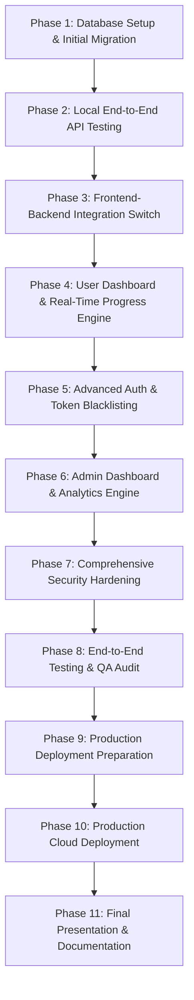
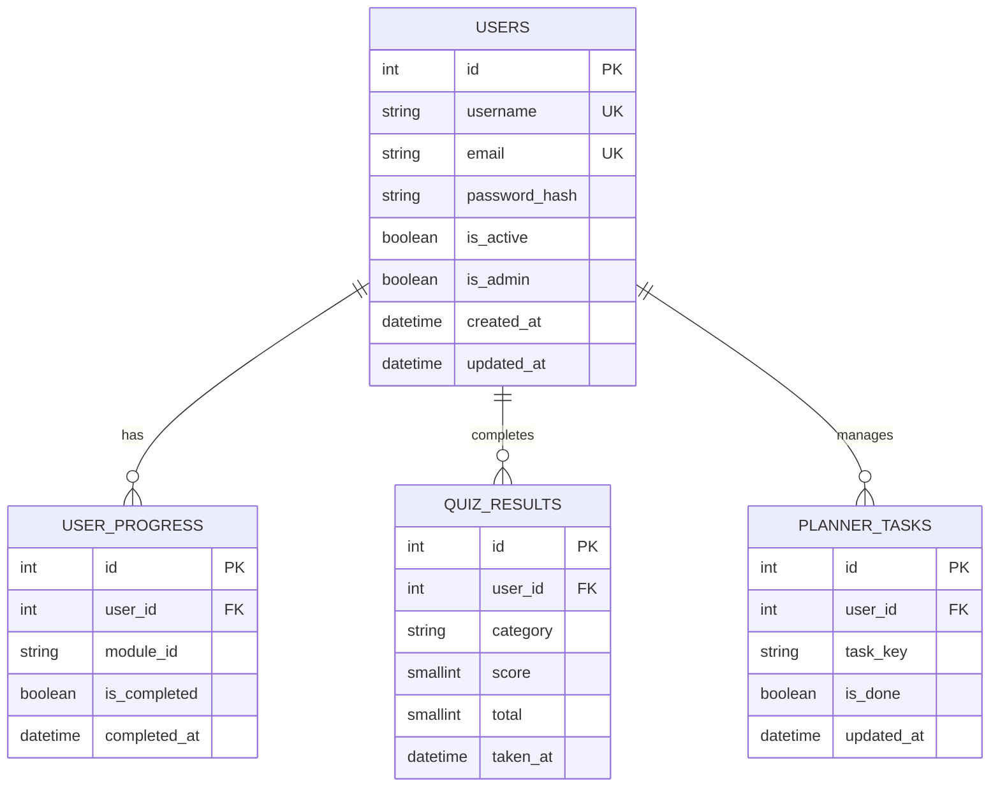

# VELORASEC — DEVELOPMENT ROADMAP & PROJECT SPECIFICATION
**Dokumen Perancangan, Arsitektur, dan Roadmap Pengembangan Web Application Full Stack**  
**Role:** Senior Full Stack Software Architect, Technical Lead, & Project Manager  
**Tanggal Update:** 23 Juli 2026  
**Status Project:** Pre-Integration & Database Execution Phase  

---

## 1. Ringkasan Kondisi Project Saat Ini

Platform **VeloraSec** adalah aplikasi web edukasi keamanan siber (*Cybersecurity Learning Hub*) yang dirancang berbasis arsitektur **Full Stack Web Application**. Kode dan struktur project saat ini berada pada tahap yang sangat matang, di mana seluruh fondasi frontend service layer dan backend Flask API telah selesai dibuat di tingkat kode (*code-complete*).

### A. Frontend
* **Teknologi:** HTML5, Vanilla CSS (Dark Mode Glassmorphism), Vanilla JavaScript (ES6 Modules/Objects).
* **Kondisi Saat Ini:**
  * Halaman utama (`index.html`) berfungsi sebagai Single Page Application (SPA) berbasis Hash Routing (`#dashboard`, `#roadmap`, `#modules`, `#labs`, `#quiz`, `#planner`).
  * Autentikasi (`login.html`, `register.html`, `forgot-password.html`) memiliki arsitektur mandiri.
  * Memiliki Service Layer lengkap (`config.js`, `token.js`, `api.js`, `auth.js`) dengan fitur `DEMO_MODE` yang dapat diswitch antara data lokal statis dan API Flask.
  * Bebas dari dependency CDN Tailwind CSS (menggunakan Vanilla CSS murni untuk performa tinggi).

### B. Backend
* **Teknologi:** Python 3.11/3.14, Flask 3.0.3, Flask-SQLAlchemy 3.1.1, Flask-Migrate 4.0.7, Flask-JWT-Extended 4.6.0, Flask-Bcrypt 1.0.1, Flask-CORS 4.0.1, PyMySQL 1.1.1.
* **Kondisi Saat Ini:**
  * Menggunakan **Application Factory Pattern (`create_app()`)** di `app.py`.
  * Memiliki 6 Blueprint terpisah (`auth`, `users`, `progress`, `quiz`, `planner`, `dashboard`).
  * Layer bisnis diisolasi di folder `services/` (`auth_service.py`, `user_service.py`).
  * Seluruh file Python (21 file) telah teruji bebas dari *syntax error*.

### C. Database
* **Teknologi:** MySQL 8.0+ (via XAMPP) dengan PyMySQL Driver.
* **Kondisi Saat Ini:**
  * Skema Database ORM SQLAlchemy telah selesai 100% di `models/` (`User`, `UserProgress`, `QuizResult`, `PlannerTask`) lengkap dengan relasi *foreign key*, *indexing*, *unique constraints*, dan *cascade delete*.
  * Database fisik `velorasec` di MySQL XAMPP siap dibuat dan di-migrate (`flask db upgrade`).

### D. Deployment
* **Kondisi Saat Ini:**
  * *Virtual environment* (`venv`) dan file dependensi `requirements.txt` sudah terkonfigurasi di lokal.
  * File `.env` dan `.env.example` sudah disiapkan.
  * Belum dilakukan konfigurasi WSGI Server (Gunicorn) dan SSL Certificate untuk lingkungan production server.

### E. API
* **Kondisi Saat Ini:**
  * 17 Endpoint REST API telah selesai diimplementasikan di backend Flask.
  * Frontend `api.js` sudah menyediakan *Unified Facade API* (`VeloraSec.API.*`) yang mendukung HTTP Bearer Token, request timeout (10 detik), dan kustom error handling (`ApiError`).

### F. Authentication
* **Kondisi Saat Ini:**
  * Menggunakan JWT (*JSON Web Tokens*) terenkripsi dengan Access Token (15 menit) dan Refresh Token (30 hari).
  * Frontend dilengkapi `TokenManager` dan `SessionManager` untuk menangani *storage*, *expiry checking*, dan *auto-logout*.

### G. Security
* **Kondisi Saat Ini:**
  * Password di-hash menggunakan `bcrypt` dengan *salt*.
  * Endpoint `login` dan `forgot-password` menggunakan teknik *anti-user-enumeration*.
  * Konfigurasi CORS dibatasi secara spesifik pada origin lokal yang terdaftar.

---

## 2. Persentase Progress Project Saat Ini

```
[==================================================]
Frontend           : 95%  [=========================-]
Backend            : 90%  [========================--]
Database           : 75%  [===================-------]
API & Auth         : 90%  [========================--]
Security           : 85%  [======================----]
Deployment         : 40%  [==========----------------]
OVERALL PROJECT    : 80%  [====================------]
```

* **Frontend:** 95%
* **Backend:** 90%
* **Database:** 75%
* **Deployment:** 40%
* **API & Auth:** 90%
* **Security:** 85%
* **Overall Project:** **80%**

---

## 3. Roadmap Pengembangan (Phase Overview)

Roadmap di bawah ini dirancang secara efisien agar pengembangan tidak mengulang pekerjaan yang sudah selesai, melainkan melanjutkan tahap akhir hingga siap dikumpulkan/di-deploy.



---

## 4. Detail Setiap Phase

### Phase 1 — Database Setup & Initial Migration
* **Tujuan:** Membuat database fisik `velorasec` di MySQL XAMPP dan mengeksekusi skema tabel dari ORM SQLAlchemy.
* **Deskripsi Pekerjaan:**
  1. Menjalankan modul MySQL di XAMPP Control Panel.
  2. Membuat database `velorasec` di phpMyAdmin.
  3. Menjalankan migrasi Flask (`flask db init`, `flask db migrate`, `flask db upgrade`).
* **Requirement:** XAMPP, Python `venv` backend.
* **Dependency:** None.
* **Tingkat Prioritas:** **CRITICAL (P0)**.
* **Estimasi Kompleksitas:** Low (15–30 menit).
* **Checklist Implementasi:**
  - [ ] Service MySQL XAMPP running di port 3306.
  - [ ] Database `velorasec` dibuat di phpMyAdmin (Collation: `utf8mb4_unicode_ci`).
  - [ ] `.env` memuat `DB_USER=root`, `DB_PASSWORD=`, `DB_NAME=velorasec`.
  - [ ] Perintah `flask db upgrade` sukses mengeksekusi migrasi tanpa error.
  - [ ] Tabel `users`, `user_progress`, `quiz_results`, `planner_tasks`, dan `alembic_version` terbentuk di phpMyAdmin.

---

### Phase 2 — Local End-to-End API Testing
* **Tujuan:** Memastikan seluruh 17 endpoint Flask dapat membaca dan menulis data ke database MySQL.
* **Deskripsi Pekerjaan:** Melakukan pengujian HTTP request (menggunakan Postman, Thunder Client, atau PowerShell) ke endpoint `/api/auth/register`, `/api/auth/login`, `/api/users/me`, `/api/progress`, `/api/quiz/results`, `/api/planner`, dan `/api/dashboard/summary`.
* **Requirement:** Database MySQL aktif, Flask dev server running (`flask run`).
* **Dependency:** Phase 1.
* **Tingkat Prioritas:** **HIGH (P1)**.
* **Estimasi Kompleksitas:** Low (30–45 menit).
* **Checklist Implementasi:**
  - [ ] `POST /api/auth/register` berhasil membuat user baru dengan `password_hash` terenkripsi bcrypt.
  - [ ] `POST /api/auth/login` mengembalikan `access_token` dan `refresh_token`.
  - [ ] Request dengan header `Authorization: Bearer <token>` berhasil mengakses `/api/users/me`.
  - [ ] Endpoint `/api/progress` berhasil melakukan *upsert* data progress modul.
  - [ ] Endpoint `/api/planner/<task_key>` berhasil men-toggle status task.

---

### Phase 3 — Frontend & Backend Integration Switch
* **Tujuan:** Menghubungkan frontend ke backend Flask secara live.
* **Deskripsi Pekerjaan:** Mengubah nilai `DEMO_MODE: false` di `frontend/assets/js/config.js` dan menyesuaikan alur login/register di UI.
* **Requirement:** Backend Flask running di `http://localhost:5000`, Live Server frontend running di `http://localhost:5500`.
* **Dependency:** Phase 2.
* **Tingkat Prioritas:** **HIGH (P1)**.
* **Estimasi Kompleksitas:** Medium (1 jam).
* **Checklist Implementasi:**
  - [ ] `VELORASEC_CONFIG.DEMO_MODE` diset ke `false`.
  - [ ] Registrasi dari UI `register.html` menyimpan data user nyata ke database MySQL.
  - [ ] Login dari `login.html` menyimpan JWT asli ke `localStorage` dan meredirect ke `#dashboard`.
  - [ ] Tombol Logout di UI membersihkan token lokal dan mengarahkan user kembali ke `login.html`.

---

### Phase 4 — User Dashboard & Real-Time Progress Engine
* **Tujuan:** Menyinkronkan seluruh UI SPA (modul, quiz, planner, statistik) dengan database secara real-time.
* **Deskripsi Pekerjaan:** Memastikan fungsi `buildDashboard()` di `script.js` mengambil data langsung dari `VeloraSec.API.Dashboard.getSummary()` dan memperbarui XP, streak, serta persentase penyelesaian secara dinamis.
* **Requirement:** Frontend terintegrasi live dengan API.
* **Dependency:** Phase 3.
* **Tingkat Prioritas:** **HIGH (P1)**.
* **Estimasi Kompleksitas:** Medium (2 jam).
* **Checklist Implementasi:**
  - [ ] Menyelesaikan modul di UI memperbarui status `is_completed` di database MySQL.
  - [ ] Menyelesaikan quiz langsung menyimpan skor ke tabel `quiz_results`.
  - [ ] Menandai planner task di UI memperbarui tabel `planner_tasks`.
  - [ ] Memuat ulang halaman (refresh) mempertahankan state progress user dari database.

---

### Phase 5 — Advanced Auth & Token Blacklisting
* **Tujuan:** Meningkatkan keamanan autentikasi dengan mekanisme pencabutan token (stateful logout).
* **Deskripsi Pekerjaan:** Membuat tabel database `token_blocklist` di Flask dan mengintegrasikan callback `token_in_blocklist_loader` pada `Flask-JWT-Extended` agar token yang telah di-logout tidak dapat digunakan kembali.
* **Requirement:** Extension `Flask-JWT-Extended`.
* **Dependency:** Phase 4.
* **Tingkat Prioritas:** **MEDIUM (P2)**.
* **Estimasi Kompleksitas:** Medium (2 jam).
* **Checklist Implementasi:**
  - [ ] Model `TokenBlocklist` ditambahkan ke database.
  - [ ] Logout dari frontend memasukkan `jti` (JWT Unique Identifier) token ke database.
  - [ ] API menolak request yang menggunakan token terblokir dengan response `401 TokenRevoked`.

---

### Phase 6 — Admin Dashboard & Analytics Engine
* **Tujuan:** Menyediakan antarmuka manajemen dan analisis data bagi administrator.
* **Deskripsi Pekerjaan:** Membuat route admin `/api/admin/users`, `/api/admin/stats` dengan proteksi decorator `@admin_required()`, serta tampilan ringkasan total user, total modul selesai, dan rata-rata skor quiz.
* **Requirement:** Field `is_admin=True` pada tabel `users`.
* **Dependency:** Phase 5.
* **Tingkat Prioritas:** **MEDIUM (P2)**.
* **Estimasi Kompleksitas:** High (3–4 jam).
* **Checklist Implementasi:**
  - [ ] Decorator `@admin_required()` memverifikasi flag `is_admin`.
  - [ ] Non-admin user yang mengakses endpoint admin menerima `403 Forbidden`.
  - [ ] Admin dapat melihat daftar seluruh user terdaftar dan statistik agregat sistem.

---

### Phase 7 — Comprehensive Security Hardening
* **Tujuan:** Memperkuat keamanan aplikasi dari potensi serangan web populer.
* **Deskripsi Pekerjaan:**
  1. Menambahkan HTTP Security Headers (X-Content-Type-Options, X-Frame-Options, CSP).
  2. Menambahkan Rate Limiting (`Flask-Limiter`) pada endpoint sensitif (`/api/auth/login`, `/api/auth/register`).
  3. Memastikan semua input disanitasi dari potensi XSS dan SQL Injection.
* **Requirement:** `Flask-Limiter`.
* **Dependency:** Phase 6.
* **Tingkat Prioritas:** **HIGH (P1)**.
* **Estimasi Kompleksitas:** Medium (2 jam).
* **Checklist Implementasi:**
  - [ ] Endpoint login dibatasi maksimal 5 percobaan per menit per IP.
  - [ ] Header `X-Frame-Options: DENY` mencegah *clickjacking*.
  - [ ] Semua query database menggunakan parameter binding SQLAlchemy (bebas SQLi).

---

### Phase 8 — End-to-End Testing & QA Audit
* **Tujuan:** Memastikan tidak ada bug, kebocoran memori, atau broken links di seluruh aplikasi.
* **Deskripsi Pekerjaan:**
  1. Melakukan pengujian fungsional pada semua modul, quiz, dan planner.
  2. Melakukan pengujian error handling (koneksi terputus, token kadaluarsa, input tidak valid).
* **Requirement:** Browser Developer Tools, PyTest (opsional).
* **Dependency:** Phase 7.
* **Tingkat Prioritas:** **HIGH (P1)**.
* **Estimasi Kompleksitas:** Medium (2–3 jam).
* **Checklist Implementasi:**
  - [ ] Seluruh tombol dan navigasi hash di UI berfungsi 100% tanpa konsol error.
  - [ ] Token kadaluarsa secara otomatis memicu refresh token atau mengarahkan ke halaman login.
  - [ ] Respons error 400, 401, 403, 404, dan 500 menampilkan alert UI yang ramah pengguna.

---

### Phase 9 — Production Deployment Preparation
* **Tujuan:** Menyiapkan seluruh konfigurasi dan artefak yang dibutuhkan untuk deployment ke lingkungan server production.
* **Deskripsi Pekerjaan:**
  1. Membuat file `Procfile` dan `gunicorn.conf.py` untuk WSGI HTTP Server.
  2. Menyesuaikan `CORS_ORIGINS` di `.env` dengan domain production.
  3. Memisahkan static assets jika menggunakan CDN.
* **Requirement:** Package `gunicorn` terinstall.
* **Dependency:** Phase 8.
* **Tingkat Prioritas:** **HIGH (P1)**.
* **Estimasi Kompleksitas:** Medium (2 jam).
* **Checklist Implementasi:**
  - [ ] `gunicorn` ditambahkan ke `requirements.txt`.
  - [ ] `Procfile` dibuat dengan instruksi `web: gunicorn "app:create_app()"` .
  - [ ] Environtment `FLASK_ENV` diset ke `production` pada server target.

---

### Phase 10 — Production Cloud Deployment
* **Tujuan:** Mempublikasikan aplikasi VeloraSec ke internet agar dapat diakses oleh umum.
* **Deskripsi Pekerjaan:**
  1. Deploy Backend Flask ke platform PaaS (seperti Render, Railway, atau VPS Ubuntu).
  2. Deploy Frontend Static ke platform Web Host (seperti Vercel, Netlify, atau Cloudflare Pages).
  3. Deploy Database MySQL ke Cloud Managed MySQL (seperti Aiven, PlanetScale, atau AWS RDS).
* **Requirement:** Akun cloud hosting (Vercel & Render/Railway).
* **Dependency:** Phase 9.
* **Tingkat Prioritas:** **HIGH (P1)**.
* **Estimasi Kompleksitas:** High (3–4 jam).
* **Checklist Implementasi:**
  - [ ] Database MySQL cloud aktif dan terhubung via SSL/TLS.
  - [ ] Backend Flask live dengan domain HTTPS resmi.
  - [ ] Frontend live dan terhubung penuh ke Backend API production.

---

### Phase 11 — Final Presentation & Documentation
* **Tujuan:** Menyusun dokumentasi akhir project untuk keperluan laporan tugas akhir dan presentasi.
* **Deskripsi Pekerjaan:**
  1. Melengkapi `README.md` utama project dengan screenshot, fitur, dan arsitektur sistem.
  2. Membuat slide presentasi demo aplikasi.
* **Requirement:** Project live & fully functional.
* **Dependency:** Phase 10.
* **Tingkat Prioritas:** **MEDIUM (P2)**.
* **Estimasi Kompleksitas:** Low (2 jam).
* **Checklist Implementasi:**
  - [ ] Dokumentasi API lengkap dengan contoh request/response.
  - [ ] Video/Screenshot demonstrasi fitur utama siap dipresentasikan.

---

## 5. Database Roadmap

### A. Struktur Tabel & Relasi (Entity Relationship Specification)



### B. Detail Tabel

1. **`users` (Primary Auth Table):**
   * `id`: INT (Primary Key, Auto Increment)
   * `username`: VARCHAR(50) (Unique, Not Null, Index)
   * `email`: VARCHAR(255) (Unique, Not Null, Index)
   * `password_hash`: VARCHAR(255) (Bcrypt Hash, Not Null)
   * `is_active`: BOOLEAN (Default: True)
   * `is_admin`: BOOLEAN (Default: False)
   * `created_at` / `updated_at`: DATETIME

2. **`user_progress` (Module Tracking):**
   * `id`: INT (Primary Key, Auto Increment)
   * `user_id`: INT (Foreign Key -> `users.id` ON DELETE CASCADE)
   * `module_id`: VARCHAR(50) (Contoh: 'tcp-ip', 'sql-injection')
   * `is_completed`: BOOLEAN (Default: False)
   * `completed_at`: DATETIME (Nullable)
   * *Unique Constraint:* `(user_id, module_id)`

3. **`quiz_results` (Quiz Performance):**
   * `id`: INT (Primary Key, Auto Increment)
   * `user_id`: INT (Foreign Key -> `users.id` ON DELETE CASCADE)
   * `category`: VARCHAR(100) (Contoh: 'Network', 'Web')
   * `score`: SMALLINT (Jumlah benar)
   * `total`: SMALLINT (Total soal)
   * `taken_at`: DATETIME

4. **`planner_tasks` (30-Day Study Planner):**
   * `id`: INT (Primary Key, Auto Increment)
   * `user_id`: INT (Foreign Key -> `users.id` ON DELETE CASCADE)
   * `task_key`: VARCHAR(20) (Format: 'w0d0', 'w1d3')
   * `is_done`: BOOLEAN (Default: False)
   * `updated_at`: DATETIME
   * *Unique Constraint:* `(user_id, task_key)`

---

## 6. Backend Roadmap

### A. Endpoint Architecture

| Blueprint | Method | Path | Proteksi | Fungsi |
|---|---|---|---|---|
| **Health** | `GET` | `/api/health` | Public | System status check |
| **Auth** | `POST` | `/api/auth/register` | Public | Registrasi user baru |
| **Auth** | `POST` | `/api/auth/login` | Public | Login & penerbitan JWT |
| **Auth** | `POST` | `/api/auth/refresh` | Refresh Token | Perbarui Access Token |
| **Auth** | `POST` | `/api/auth/logout` | JWT | Logout user |
| **Auth** | `POST` | `/api/auth/forgot-password` | Public | Request reset password |
| **Users** | `GET` | `/api/users/me` | JWT | Ambil profil user login |
| **Users** | `PUT` | `/api/users/me` | JWT | Update profil user |
| **Progress**| `GET` | `/api/progress` | JWT | Ambil seluruh progress modul |
| **Progress**| `POST` | `/api/progress` | JWT | Upsert progress modul |
| **Progress**| `DELETE`| `/api/progress` | JWT | Reset seluruh progress user |
| **Quiz** | `GET` | `/api/quiz/results` | JWT | Riwayat quiz (opsional: `?category=`) |
| **Quiz** | `POST` | `/api/quiz/results` | JWT | Simpan hasil quiz baru |
| **Planner** | `GET` | `/api/planner` | JWT | Ambil seluruh task planner |
| **Planner** | `POST` | `/api/planner/<task_key>` | JWT | Toggle status task |
| **Planner** | `DELETE`| `/api/planner` | JWT | Reset seluruh task planner |
| **Dashboard**| `GET` | `/api/dashboard/summary` | JWT | Aggregated dashboard data |

---

## 7. Frontend Integration Roadmap

### A. API Service Layer Mapping

Seluruh halaman frontend berkomunikasi dengan backend melalui **`window.VeloraSec.API`** ([frontend/assets/js/api.js](file:///d:/VeloraSec-main/frontend/assets/js/api.js)):

```javascript
// Struktur Facade Terintegrasi:
VeloraSec.API = {
  Auth: {
    login(email, password),
    register(username, email, password),
    logout(),
    refresh(),
    forgotPassword(email),
  },
  Users: {
    getMe(),
    updateMe(data),
  },
  Progress: {
    getAll(),
    update(moduleId, isCompleted),
    reset(),
  },
  Quiz: {
    getResults(category),
    saveResult(category, score, total),
  },
  Planner: {
    getAll(),
    toggleTask(taskKey),
    reset(),
  },
  Dashboard: {
    getSummary(),
  }
};
```

---

## 8. Deployment Roadmap

### A. Frontend Deployment (Static Hosting)
* **Platform Rekomendasi:** Vercel atau Cloudflare Pages.
* **Instruksi:**
  1. Connect repository GitHub VeloraSec.
  2. Set Root Directory ke `frontend/pages`.
  3. Set Build Command: *(Kosongkan - Static HTML)*.

### B. Backend Deployment (PaaS / Container)
* **Platform Rekomendasi:** Render.com atau Railway.app.
* **Instruksi:**
  1. Connect repository GitHub VeloraSec.
  2. Set Root Directory ke `backend`.
  3. Environment Variables: Set `FLASK_ENV=production`, `SECRET_KEY`, `JWT_SECRET_KEY`, `DB_HOST`, `DB_USER`, `DB_PASSWORD`, `DB_NAME`, `CORS_ORIGINS`.
  4. Start Command: `gunicorn "app:create_app()"` .

### C. Database Deployment (Cloud MySQL)
* **Platform Rekomendasi:** Aiven.io (Free Tier MySQL) atau PlanetScale.
* **Instruksi:**
  1. Buat instance MySQL 8.0 di Aiven/PlanetScale.
  2. Ambil URI koneksi SSL.
  3. Masukkan connection string ke Environment Variables backend Render.
  4. Jalankan `flask db upgrade` dari console Render.

---

## 9. Security Checklist

- [x] **Password Hashing:** Menggunakan `Bcrypt` dengan salt otomatis.
- [x] **JWT Security:** Access Token berumur pendek (15 menit), Refresh Token berumur panjang (30 hari).
- [x] **CORS Restriction:** Hanya mengizinkan origin yang terdaftar di `.env`.
- [x] **SQL Injection Prevention:** Menggunakan ORM SQLAlchemy berbasis parameterized queries.
- [x] **XSS Defense:** Encoding output dan pengisolasian JWT via Manager Object.
- [ ] **Rate Limiting:** Terapkan `Flask-Limiter` pada endpoint autentikasi sebelum production.
- [ ] **HTTPS Enforcement:** Pastikan SSL Certificate (TLS 1.3) aktif di lingkungan cloud production.

---

## 10. Testing Checklist

- [x] **Syntax Validation:** Seluruh 21 file Python backend lulus `py_compile`.
- [x] **Dependency Check:** Seluruh package Python terinstall tanpa konflik di `venv`.
- [ ] **Authentication Test:** Uji alur register, login, invalid password, dan token expired.
- [ ] **Data Persistence Test:** Menyimpan progress modul, quiz, dan planner, lalu memverifikasi data di phpMyAdmin.
- [ ] **Cross-Origin Test:** Memastikan request dari Live Server frontend (`http://localhost:5500`) diterima oleh backend Flask (`http://localhost:5000`).

---

## 11. Final Checklist (Kesiapan Tugas Akhir)

- [ ] Modul MySQL XAMPP berjalan dan DB `velorasec` telah dibuat.
- [ ] Migrasi database `flask db upgrade` telah sukses dieksekusi.
- [ ] Saklar `DEMO_MODE` pada `config.js` diubah ke `false`.
- [ ] Aplikasi Full Stack berjalan sempurna secara lokal (Frontend + Backend + MySQL).
- [ ] Laporan dan dokumentasi API siap dipresentasikan.

---
*VeloraSec Full Stack Cybersecurity Learning Hub — Project Specification & Roadmap 2026*
